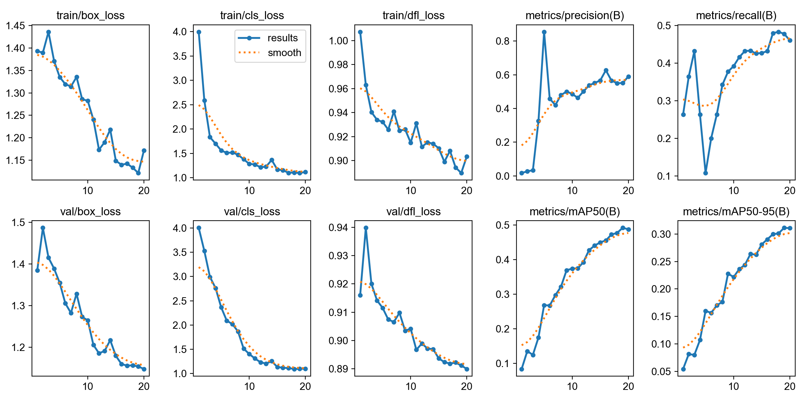
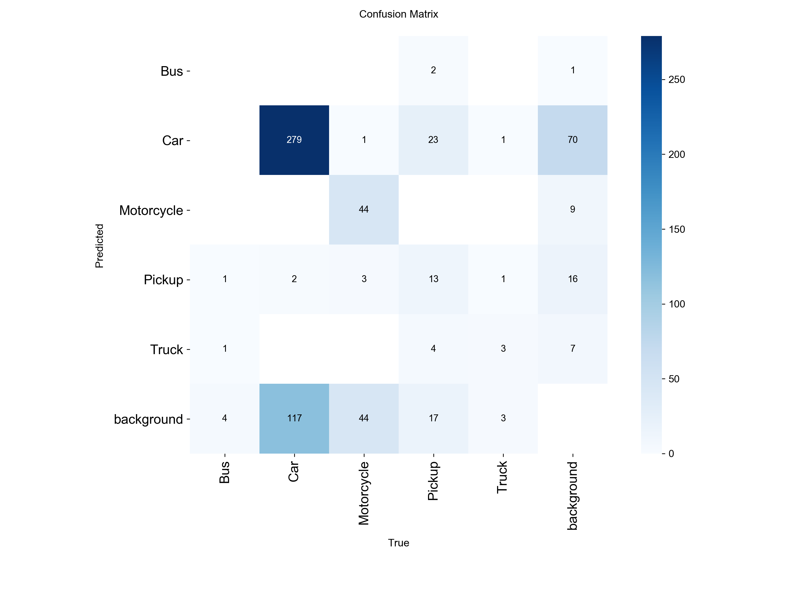
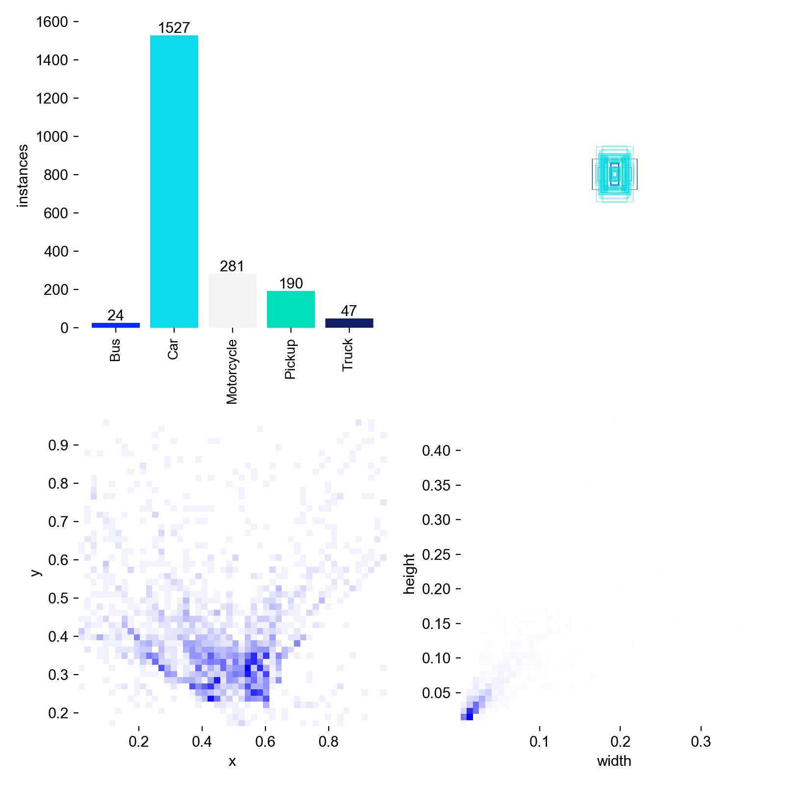
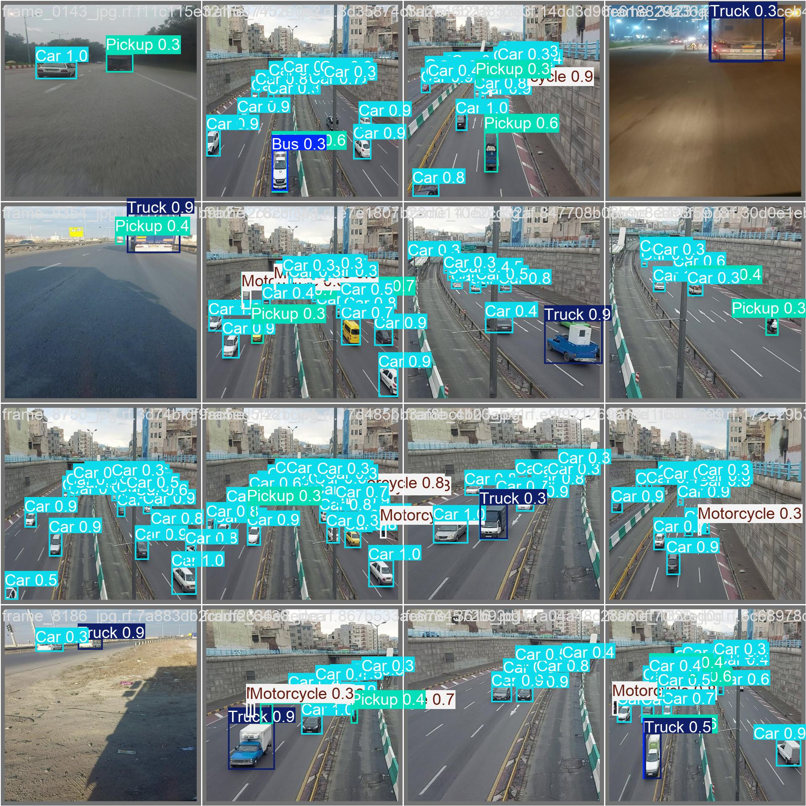

# Multi-Class Vehicle Detection Using YOLOv8

This project explores multi-class vehicle detection in traffic scenes using YOLOv8.

## Vehicle Categories
- Bus
- Car
- Motorcycle
- Pickup
- Truck

## Project Goals
- Build a baseline vehicle detector using YOLOv8
- Compare different training settings and model variants
- Analyze per-class detection performance
- Extend the project to video inference

## Dataset
The dataset is organized in YOLO format with:
- train
- valid
- test
- data.yaml

## Baseline Results (YOLOv8n, 20 epochs)

### Overall Performance
- Precision: 0.551
- Recall: 0.478
- mAP50: 0.492
- mAP50-95: 0.311

### Key Observations
- Car achieved the strongest detection performance.
- Bus and Truck were less stable, likely due to fewer validation samples.
- Motorcycle showed relatively high precision but lower recall.

### Training Curve

### Confusion Matrix

### Label Distribution

### Prediction Example

## Experiment Comparison

| Version | Model | Epochs | Precision | Recall | mAP50 | mAP50-95 |
|---|---|---:|---:|---:|---:|---:|
| v1 | YOLOv8n | 20 | 0.551 | 0.478 | 0.492 | 0.311 |
| v2 | YOLOv8n | 50 | 0.795 | 0.563 | 0.655 | 0.419 |

Training for more epochs led to a substantial improvement in overall detection performance, especially in mAP50 and mAP50-95.

## Current Progress
- [x] Dataset prepared
- [x] YOLOv8n baseline trained for 20 epochs
- [x] 50-epoch experiment
- [ ] Model comparison
- [ ] Grayscale vs RGB comparison
- [ ] Video inference demo