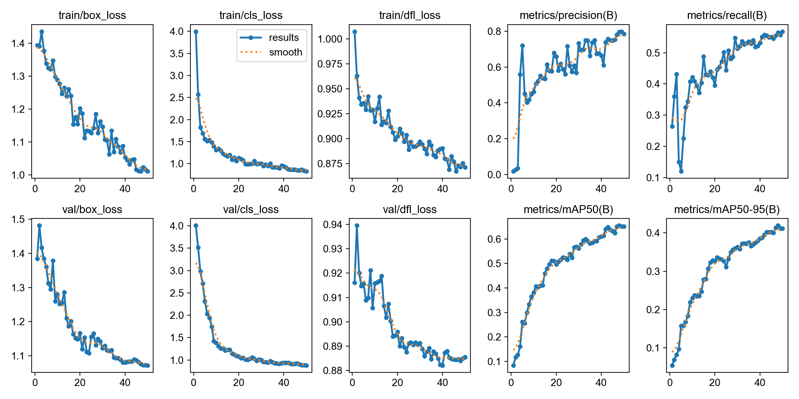
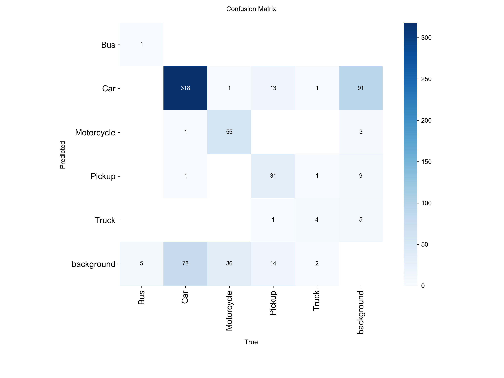
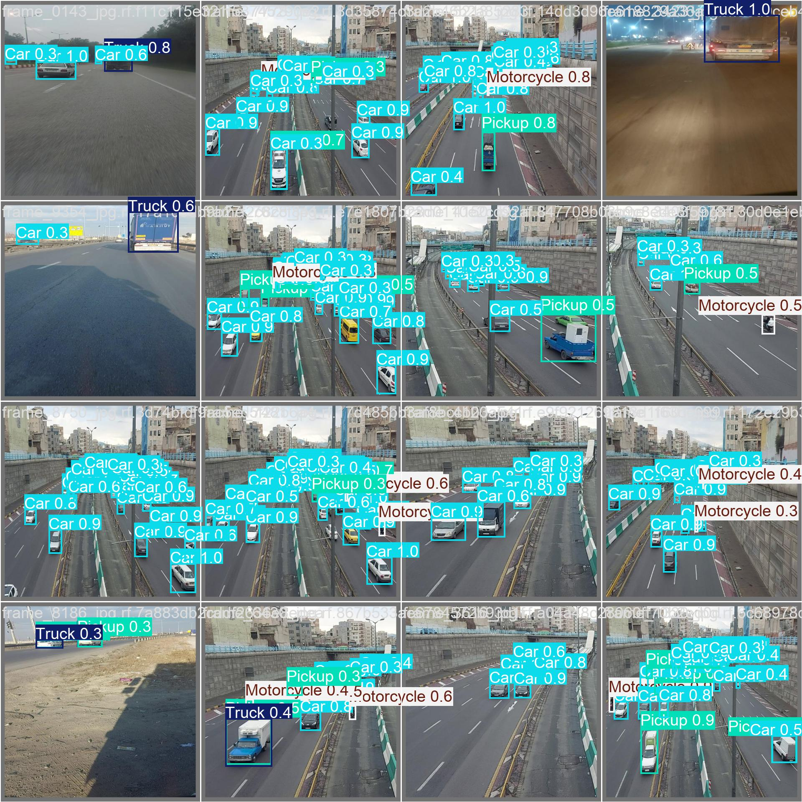
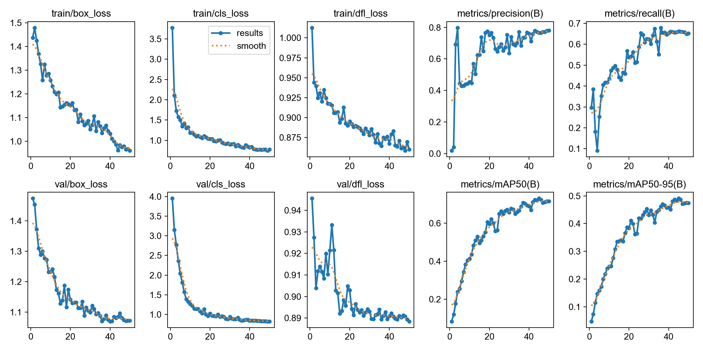
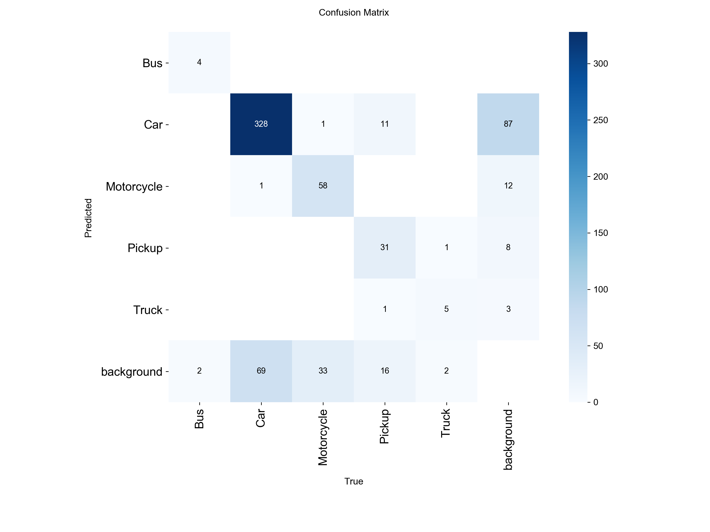
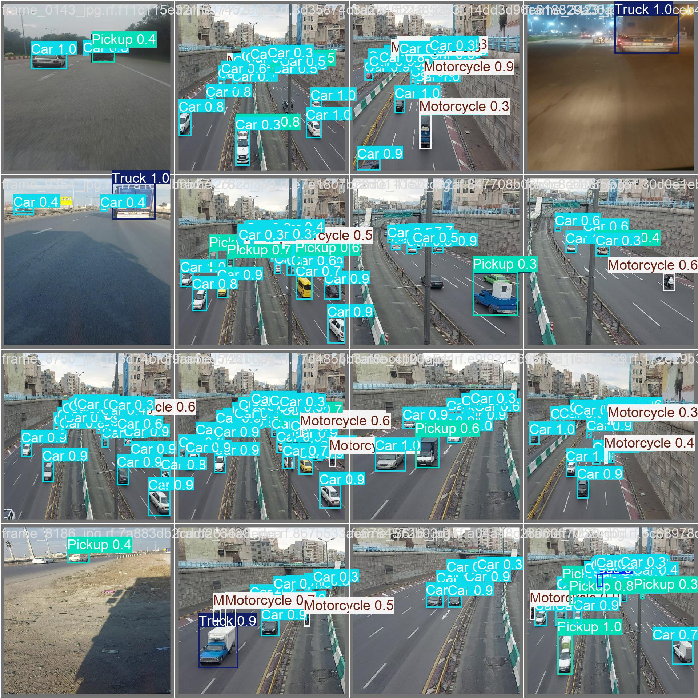

# Multi-Class Vehicle Detection Using YOLOv8

This project explores multi-class vehicle detection in traffic scenes using YOLOv8.

## Vehicle Categories
- Bus
- Car
- Motorcycle
- Pickup
- Truck

## Project Goals
- Build a baseline vehicle detector using YOLOv8
- Compare different training settings and data augmentation strategies
- Analyze per-class detection performance
- Extend the project to video inference

## Dataset
The dataset is organized in YOLO format with:
- train
- valid
- test
- data.yaml

## Baseline Results (YOLOv8n, 20 epochs)

### Overall Performance
- Precision: 0.551
- Recall: 0.478
- mAP50: 0.492
- mAP50-95: 0.311

### Key Observations
- Car achieved the strongest detection performance.
- Bus and Truck were less stable, likely due to fewer validation samples.
- Motorcycle showed relatively high precision but lower recall.

### Training Curve

### Confusion Matrix

### Label Distribution

### Prediction Example

## Improved Results (YOLOv8n, 50 epochs)

The 50-epoch setting significantly improved overall performance compared with the 20-epoch baseline, especially in mAP50 and mAP50-95.

- Precision: 0.795
- Recall: 0.563
- mAP50: 0.655
- mAP50-95: 0.419

### v2 Training Curve

### v2 Confusion Matrix

### Prediction Example

## Grayscale-Augmented Results (YOLOv8n, 50 epochs)

Compared with the RGB 50-epoch setting, grayscale augmentation improved overall recall and both mAP metrics, suggesting stronger robustness under appearance variation.

- Precision: 0.766
- Recall: 0.662
- mAP50: 0.729
- mAP50-95: 0.491

### v3 Training Curve

### v3 Confusion Matrix

### Prediction Example

## Experiment Comparison

| Version | Model | Data Setting | Epochs | Precision | Recall | mAP50 | mAP50-95 |
|---|---|---|---:|---:|---:|---:|---:|
| v1 | YOLOv8n | RGB | 20 | 0.551 | 0.478 | 0.492 | 0.311 |
| v2 | YOLOv8n | RGB | 50 | 0.795 | 0.563 | 0.655 | 0.419 |
| v3 | YOLOv8n | Grayscale-augmented | 50 | 0.766 | 0.662 | 0.729 | 0.491 |

The 50-epoch RGB experiment substantially improved performance over the 20-epoch baseline.  
In addition, grayscale augmentation further improved recall, mAP50, and mAP50-95, suggesting that grayscale-based augmentation enhanced robustness in traffic-scene vehicle detection.

## Current Progress
- [x] Dataset prepared
- [x] YOLOv8n baseline trained for 20 epochs
- [x] 50-epoch experiment
- [ ] Model comparison
- [x] Grayscale augmentation comparison
- [ ] Video inference demo